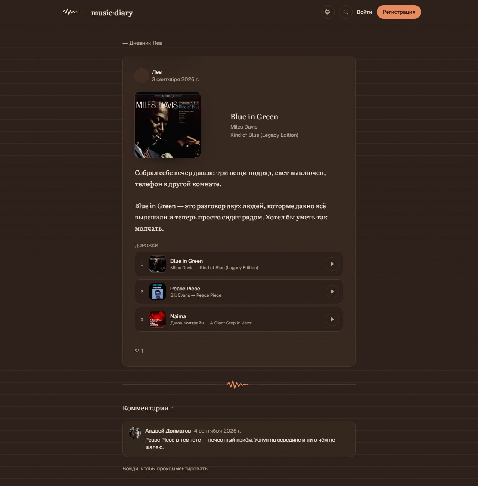
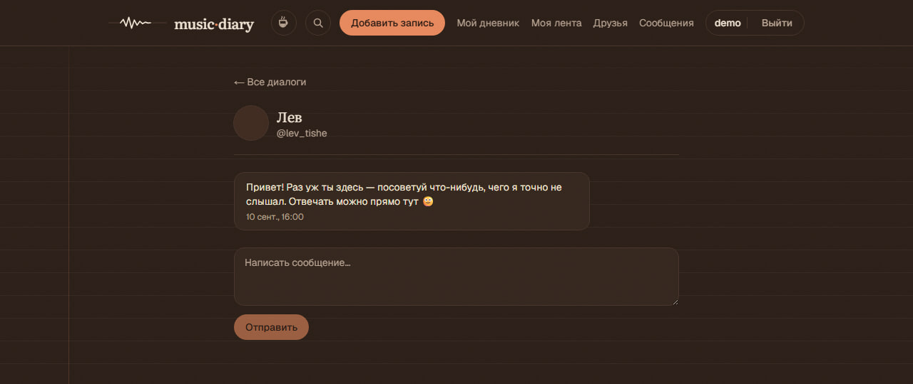

# music·diary

A blogging platform where every entry is a personal note plus the track that
belongs to it. You write what you want to remember; the track metadata (title,
artist, artwork, 30-second preview) is pulled from an external API and cached.
The writing lives in your own database — the API only ever supplies the record
sleeve.

**Live:** https://daires.vercel.app · **Interface language:** Russian

**Try it without signing up:** on [the sign-in page](https://daires.vercel.app/login)
press **«Войти как гость»** (“Sign in as guest”). It is one shared demo account,
reset to a clean state on every guest sign-in — post, like, reply to the message
that is waiting for you.


<p>
  
  
</p>



<sub>The feed · one entry with three tracks and a comment · the feed on a
phone · a direct message in the demo account. Captured from production.</sub>

---

## What it does

| Area | Details |
|---|---|
| **Entries** | Text + any number of tracks per entry (ordered), track search against iTunes with MusicBrainz as fallback, unique slugs, per-day archive pages |
| **Reading** | Public feed, per-author diary, single-entry pages, infinite scroll with a keyboard-reachable "More" button, RSS for both the global feed and every author |
| **Social** | Comments, likes, follows with a personal feed, mutual friendships (request + accept, separate from follows), one-to-one direct messages gated on friendship |
| **Playback** | One `<audio>` element per tab driving a queue: a preview finishes and the next one starts by itself; a broken track doesn't end the album |
| **Search** | Site-wide full-text search over entries, tracks and users — Postgres FTS, no external search service |
| **Profiles** | Avatar upload, bio, per-profile statistics (entries, top artists) |
| **Moderation** | Admin section: entry and comment moderation, user roles, account deletion, a report queue, and orphaned-track cache cleanup |
| **Live delivery** | Realtime pings for new messages and friend requests — header counters update without polling |

## Stack

Next.js 16 (App Router) · React 19 · TypeScript · Prisma 7 + PostgreSQL
(Supabase) · Better Auth · Tailwind CSS v4 · deployed on Vercel.

Roughly 11,000 lines across `app/`, `components/` and `lib/`; 15 Prisma models;
9 migrations.

## How it is organised

```
app/            routes (App Router) — each route owns its own actions.ts
components/     presentational and client components
lib/            the query layer, server actions shared by several routes,
                schemas, and everything with no natural route owner
prisma/         schema + migrations (two of them written by hand)
```

Two conventions carry most of the weight:

- **Mutations are Server Actions, not API routes.** The only route handlers in
  the project are the Better Auth catch-all and the two RSS feeds, and both
  exceptions are argued in place.
- **A decision is documented as a comment next to the line it applies to**, not
  in a separate document. A comment is edited by the same diff as the code, so
  it cannot quietly drift out of date. `AGENTS.md` holds only what the code
  cannot state: rules, traps, and the price of past decisions.

## Decisions and what they cost

This is the part worth reading. Every one of these was measured rather than
assumed, and each was taken with its downside known.

**Realtime is a doorbell, not a transport.**
Supabase Realtime authorises private channels through RLS policies that read
claims from a Supabase JWT — and our session lives in Better Auth, so to
Supabase every user is anonymous. First-class third-party auth covers
Clerk/Auth0/Firebase/Cognito/WorkOS; Better Auth is not on the list. So the
channel is public, named `user:<userId>`, and carries an **empty payload**: the
ping says "something arrived", and the browser then fetches the content through
the ordinary session-authenticated path.
*The cost:* somebody who knows your `userId` (32 random characters, never shown
in the UI) can observe that a message arrived and when — but not its text and
not its sender.

**`notFound()` hides the body, and only the body.**
The admin section returns a 404 rather than redirecting to a login page, so it
doesn't advertise its own existence. Both limits of that masking were measured
rather than assumed: `notFound()` thrown from a streaming page still answers
**HTTP 200**, so the address is distinguishable from a real 404 by status code;
and the layout's static `metadata` resolves *before* the page renders, which
was handing anonymous visitors a `<title>` announcing the admin area. Closed by
moving to `generateMetadata()` with a role check.
*The lesson kept:* anything that resolves separately from the page body has to
be hidden separately, and masking is cosmetics on top of the guard — never a
replacement for it.

**`directUrl` does not exist in `prisma.config.ts`.**
Prisma CLI commands had been intermittently hanging or failing with `P1001` /
`P1000` for weeks. The cause turned out to be a config field that simply isn't
in the `Datasource` type — it was silently ignored, so every CLI command was
going through the transaction pooler, which doesn't guarantee the
session-level operations migrations need (advisory locks, shadow database
creation). Found with `npx tsc --noEmit` against the real type.
*Worth noting:* the non-existent field was documented that way in Prisma's own
official upgrade skill. Vendor references are worth type-checking too.

**The auth host allowlist is narrowed to the project name.**
Every branch gets its own preview deployment, so a single hard-coded production
URL would reject sign-in on all of them. Better Auth takes a host allowlist for
exactly this. The pattern is `daires-*.vercel.app` rather than `*.vercel.app`,
because the wide version **accepted a spoofed `Origin: https://evil.vercel.app`
— verified by request**, and rejects it now.
*Residual risk, stated rather than waved away:* `vercel.app` names are global,
so a stranger could in principle claim a `daires-*` project. The session cookie
is `SameSite=Lax` and won't be sent on a cross-site POST, which makes the origin
check the second line of defence rather than the only one.

**Full-text search indexes live only in the migration folder.**
Prisma cannot declare `tsvector` or GIN indexes, so the three expression indexes
are hand-written SQL. Expression indexes were chosen over a stored generated
column: the index stays in step with the data by construction — no extra column,
no trigger. Search itself is deliberately two-phase — raw SQL fetches only `id`s
ordered by `ts_rank`, then Prisma hydrates them.
*The cost:* `schema.prisma` is no longer a complete description of the database,
and raw SQL's return type is a promise to the compiler rather than a check —
which is why it is confined to a single file.

**The feed uses a cursor; the admin lists use `OFFSET` on purpose.**
Cursor pagination for the feed, because `OFFSET` drifts when rows are inserted
mid-scroll. The admin lists take the opposite trade deliberately: a moderator
needs a total count and the ability to jump to a far page, and row drift is
harmless to somebody working through a queue rather than reading a feed.

**Changing `audio.src` during playback fires `pause` by itself.**
That's the HTML media load algorithm, and it produced a race on auto-advance
where the UI lit up and went dark again. Fixed with a flag around the
programmatic track change.

**One mark, used in exactly three places.**
The first pass at the visual identity scattered the logo roughly 27 times on a
single page. It now appears as the header logo, as a separator under every other
entry, and at the end of the feed. New ideas involving it are evaluated by
subtraction rather than addition — it works *because* it is rare.

## Running it locally

Requires Node 22 and a PostgreSQL database (Supabase, or anything Postgres).

```bash
npm install
npx prisma migrate deploy     # or `migrate dev` when changing the schema
npm run dev                   # http://localhost:3000
```

Environment variables — copy `.env.example` to `.env.local` and fill it in:

| Variable | Purpose |
|---|---|
| `DATABASE_URL` | Application runtime. Supabase transaction pooler, port 6543, `?pgbouncer=true` |
| `DIRECT_URL` | Prisma CLI only (migrate / studio). Session pooler, port 5432 — the transaction pooler cannot run migrations |
| `BETTER_AUTH_SECRET` | Signs session cookies; generate your own |
| `BETTER_AUTH_URL` | The site's canonical address; locally `http://localhost:3000` |
| `SUPABASE_URL`, `SUPABASE_SERVICE_ROLE_KEY` | Avatar storage. Server-side only — the service role key must never reach the browser |
| `NEXT_PUBLIC_SUPABASE_URL`, `NEXT_PUBLIC_SUPABASE_ANON_KEY` | Realtime in the browser. Without them the code is fine and only live delivery sleeps |

Two URLs point at the same database on purpose — see the table above.

The first administrator is promoted from outside the application
(`npm run make-admin <username>`); after that, roles are handed out from
`/admin/users`. The role field is not writable through the sign-up form, or
anyone could register themselves as an admin.

## Deployment

Vercel, through the Git integration: a push to `main` *is* the production
deploy, and every other branch gets a preview. Two things are easy to get wrong:

- `build` must stay `prisma generate && next build`. The Prisma 7 client is
  generated into `generated/`, which is git-ignored, so on a clean build machine
  the import wouldn't resolve. It can't move to `postinstall` either — that runs
  on dependency installation, and the generated folder lives outside
  `node_modules`, so a cached install would never recreate it.
- `DIRECT_URL` must exist in the build environment even though nothing at
  runtime reads it: `prisma generate` loads `prisma.config.ts`, and the config's
  `env()` throws immediately on a missing variable rather than lazily.

Serverless functions run in Dublin, matching the database region. That is not
micro-optimisation: signing in makes several sequential database round trips,
and a default US region sent every one of them across the Atlantic.

## Known gaps

Stated plainly, because knowing what's missing is part of the work:

- no password reset flow, and no email verification or rate limiting on sign-up
- no automated tests in the repository and no CI pipeline
- production and development share one database — convenient while the project
  is being shown, and to be split before it means anything

## License

MIT
